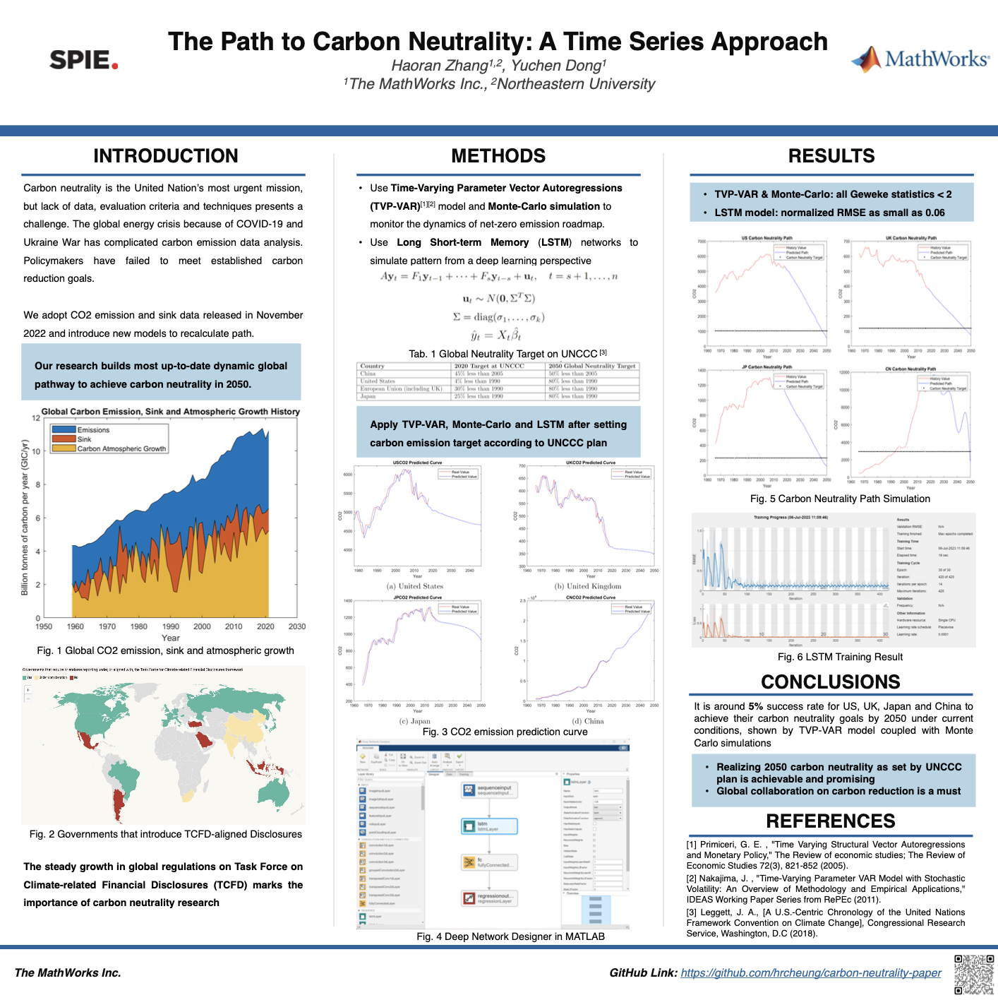
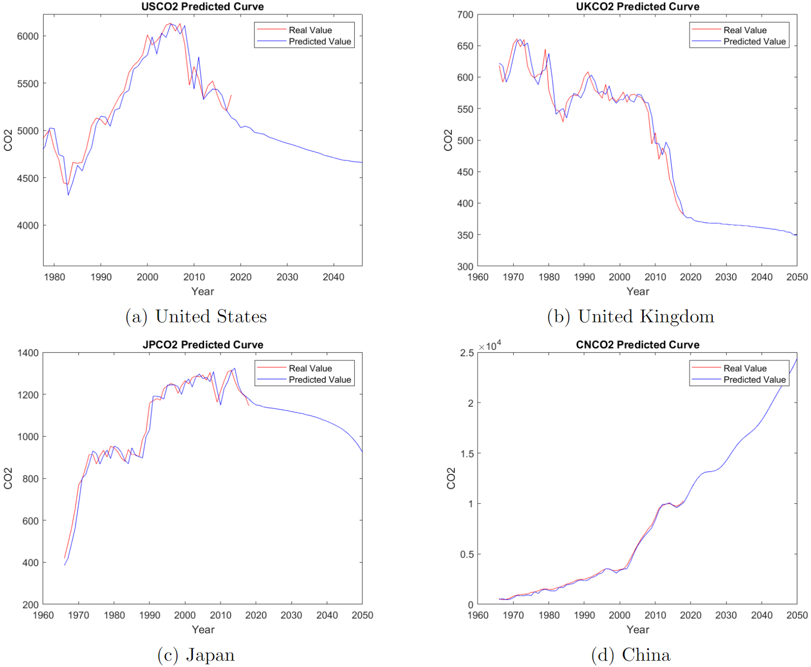
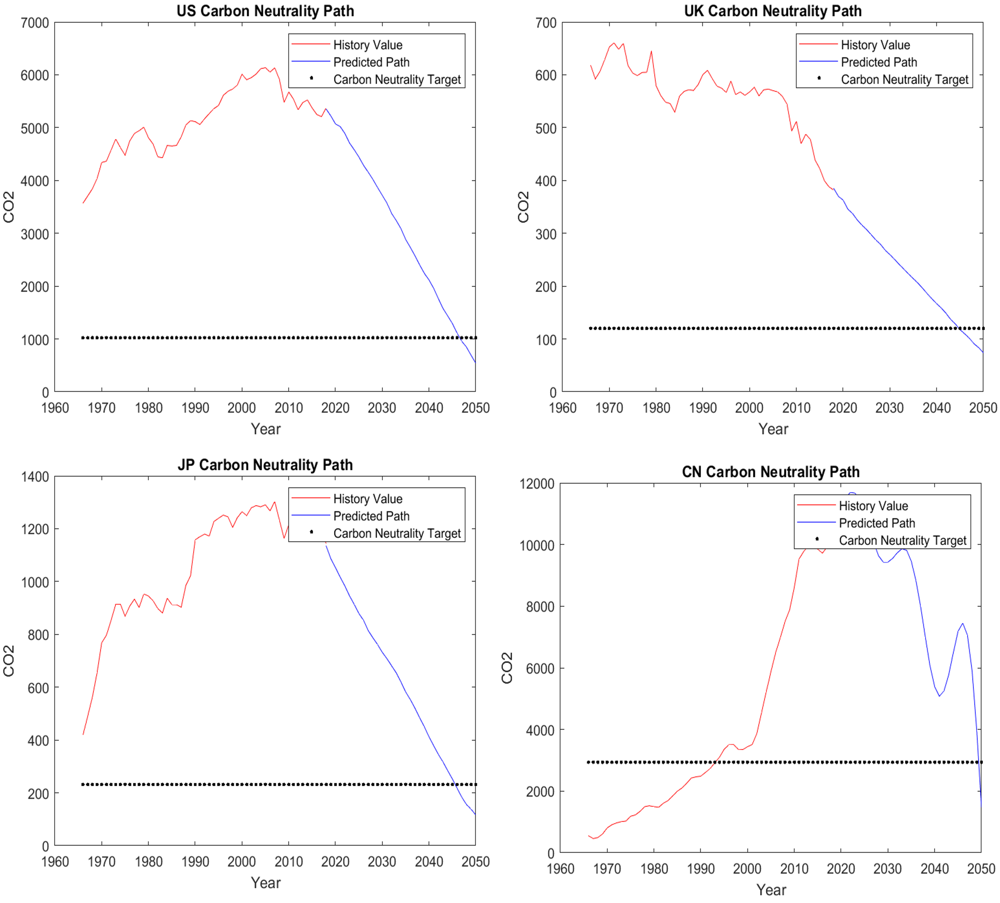
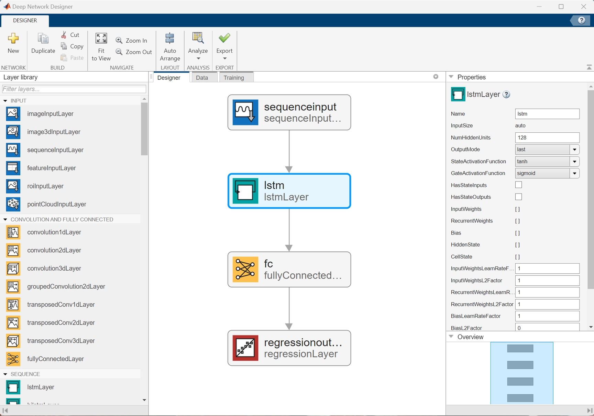
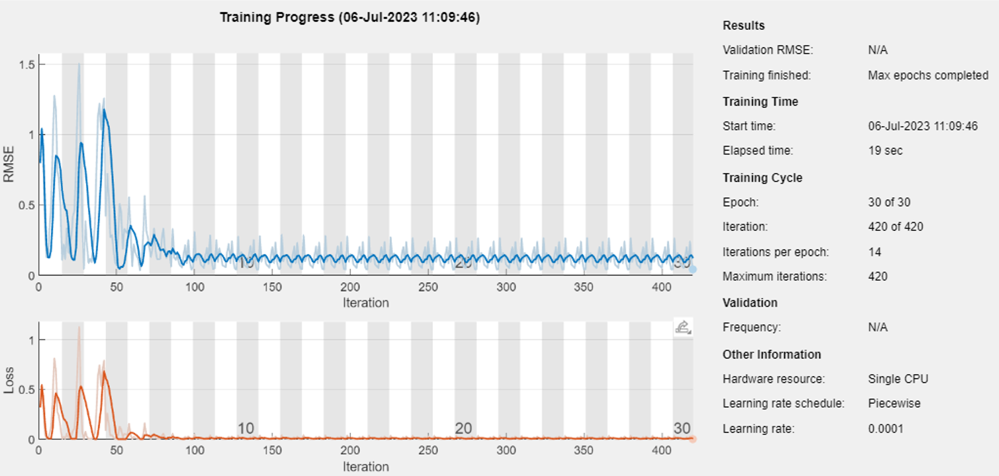

# **MATLAB Toolbox for Carbon Neutrality Simulation**  :chart_with_upwards_trend:

Achieving carbon neutrality has become the United Nation’s most urgent mission, but the lack of data, evaluation criteria and associated techniques presents a challenge. Moreover, the energy crisis in 2022 has unexpectedly complicated carbon dioxide (CO2) data, and existing research focuses primarily on CO2 absolute emissions. Policymakers have established milestones on carbon reduction roadmap but have failed to meet them. Therefore, we adopt the new CO2 emission and sink data released in November 2022. Our approach leverages Time Varying Parameter Vector Auto Regression (TVP-VAR) model and Monte-Carlo simulation to monitor the dynamics of net-zero emission roadmap. This approach provides insights into the global pathway towards The United Nations Framework Convention on Climate Change (UNFCCC).

How to use toolboxes in MATLAB for carbon neutrality simulation using **[MATLAB](https://www.mathworks.com/products/matlab.html)**.

## **Setup**
To run:
1. Open carbon_neutrality_live_script.mlx
2. Install Econometrics Toolbox, Deep Learning Toolbox
3. Run carbon_neutrality_live_script.mlx

Requires

- [MATLAB R2023a](https://www.mathworks.com/products/matlab.html)
- [Econometrics Toolbox](https://www.mathworks.com/products/econometrics.html?s_tid=srchtitle_site_search_1_econometrics)
- [Deep Learning Toolbox](https://www.mathworks.com/products/deep-learning.html)

## Overview
This example leveraged MATLAB R2023a and according toolboxes to 
1. predict carbon emission for US, UK, China and Japan with **Time Varying Parameter Vector Auto Regression** (TVP-VAR) time series model
2. add **Monte Carlo Simulation** to the TVP-VAR Model to simulate the carbon emission path to achieve carbon neutrality goals in 2050.
3. introduce **Long Short-term Memory** Deep Learning model as an alternative way to predict carbon emission

## Dataset
We use latest data released in Global Carbon Budget (November 2022 version) 
- 50+ countries
- around 100 years (1905-2022)
- variables include the amount of carbon dioxide emission, GDP, population

## Result
**CO2 prediction with TVP-VAR model**

**Carbon Neutrality Path with Monte-Carlo Simulation**

**CO2 prediction with Deep Learning designer and LSTM model**

## Conclusion 

The aim of this example was to show:

- What MATLAB Econometrics Toolbox and Deep Learning Toolbox are
- How it can be applied to simulate climate change data
- Leave a starting point for climate change professionals to use and enhance using their own domain expertise.

### Acknowledgement
I express my sincere gratitude to The MathWorks Inc. for their funding support. A special acknowledgment is extended to Jason Jumper and David Willingham, for their insightful review of both the paper and poster, and for their support in enabling my conference presentation. I also thank Professor Karl Ni at Northeastern University for his exceptional academic writing guidance. This work has been greatly enhanced by your contributions. 

